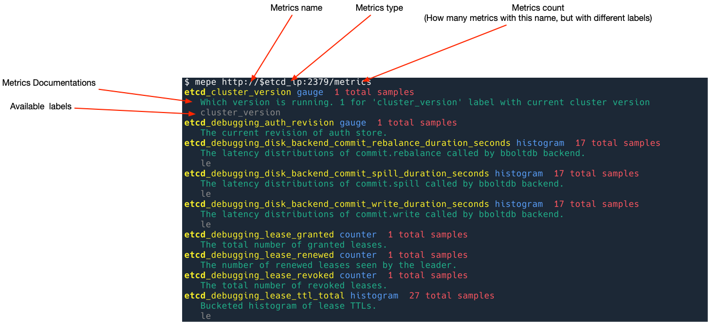

# Prometheus Metrics Explorer

Cli Prometheus metrics viewer.

Summaries metrics, useful when you configure a new Grafana dashboard for a new component, and want to check what metrics does it have.

## Installation

```shell
pip install mepe
```

## Usage

```shell
mepe http://127.0.0.1:9100/metrics
```



